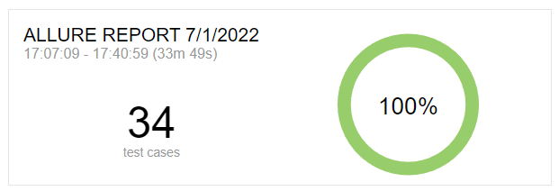

# Отчет по итогам тестирования

### Краткое описание

Было проведено тестирование мобильного приложения "В хосписе".

На первом этапе было проведено ручное тестирование для ознакомления с проектом.
Второй этап включал в себя написание автотестов, для проведения тестирования данного сервиса.

### Количество тест-кейсов

Общее количество тест-кейсов - 52

### Найденные дефекты

- [Не работают ссылки раздела About](https://github.com/Cryofbb/QA-Finale/issues/2)

# Отчет по итогам автоматизации

### Что было запланировано и что было сделано

Было запланировано 52 теста, в ходе автоматизации их количество было уменьшено до 34, путем объединения.

### Общий итог по времени

На написание тестов было затрачено меньше времени, чем ожидалось.
Но ввиду неработоспособности приложения срок тестирования увеличился и уложится в изначальные временные рамки было невозможно.

Итоговое время -

- Настройка тестового окружения - 5
- Написание и отладка автотестов - 20
- Прогон тестов и заведение issue - 3
- Подготовка отчета по итогам автоматизированного тестирования и автоматизации - 2

**Итого с учетом рисков: 30 часов**
**Время прохождения тестов в ручном режиме: 30 минут**
**Время прохождения тестов в автоматическом режиме: 9 минут**
